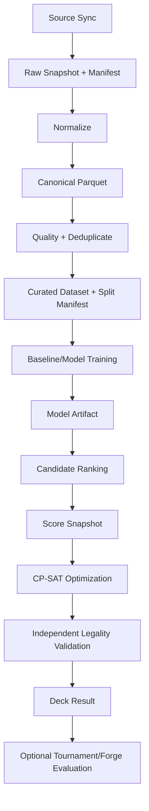

# End-to-End-Datenfluss

```mermaid
flowchart TD
    A[Source Sync] --> B[Raw Snapshot + Manifest]
    B --> C[Normalize]
    C --> D[Canonical Parquet]
    D --> E[Quality + Deduplicate]
    E --> F[Curated Dataset + Split Manifest]
    F --> G[Baseline/Model Training]
    G --> H[Model Artifact]
    H --> I[Candidate Ranking]
    I --> J[Score Snapshot]
    J --> K[CP-SAT Optimization]
    K --> L[Independent Legality Validation]
    L --> M[Deck Result]
    M --> N[Optional Tournament/Forge Evaluation]
```

Jede Pfeilstufe erzeugt ein eigenes Manifest. Keine Stufe überschreibt den Input der vorherigen Stufe.
