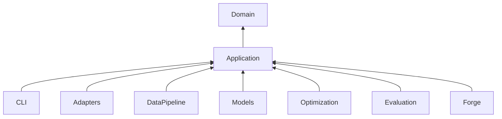

# Abhängigkeitsregeln

## Erlaubt

- `application` importiert `domain` und eigene Ports;
- Implementierungen importieren Ports und Domain;
- CLI verdrahtet konkrete Implementierungen.

## Verboten

- Domain → PyTorch, OR-Tools, DuckDB, HTTP oder CLI;
- Model → Source-Adapter oder Netzwerk;
- Optimizer → Modellimplementierung;
- Source-Adapter → anderes Source-Adapter-Package;
- Forge-Bridge → Trainingspipeline;
- SQL-Dateien → versteckte Business Rules ohne dokumentierten Test.

Die Regeln sollen in CI mit einem Import-Linter oder einem kleinen AST-Test geprüft werden.
