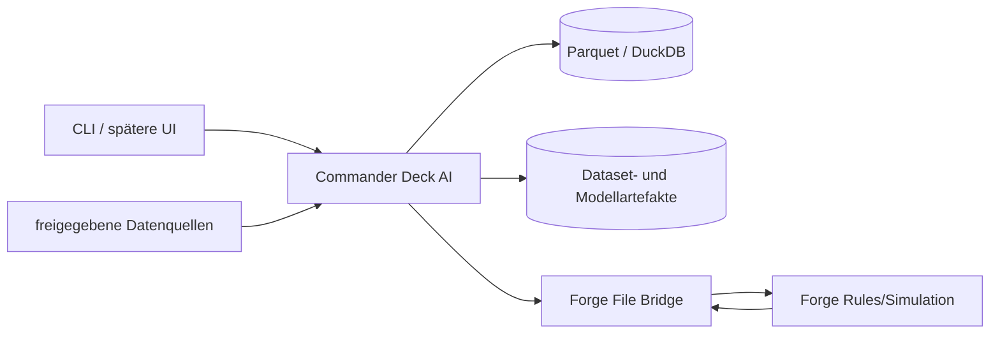

# System Context

Commander Deck AI ist Eigentümer von:

- kanonischer Deck-/Datasetrepräsentation;
- Ranking und Optimierung;
- Offline-Benchmarks;
- Provenienz- und Artefaktmanifeste.

Forge ist Eigentümer von:

- Spielregeln während einer Partie;
- Simulation und Agentverhalten;
- Simulationsresultaten mit Forge-/Agentversion.

Externe Quellen bleiben Eigentümer ihrer Daten. Das Projekt speichert nur, was der jeweilige Source-Review erlaubt.
