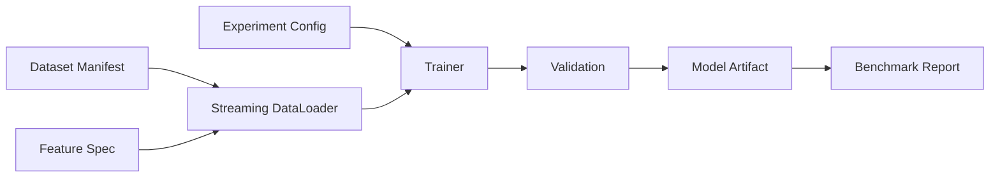

# Trainingspipeline

## Run-Manifest

- Code-Commit;
- Python-/Dependency-Lock-Hash;
- Dataset-ID und Hash;
- Feature-Spec-Version;
- Modellkonfiguration;
- Seeds;
- Hardwarebeschreibung;
- Checkpoint-Auswahlregel;
- Metriken und Warnings.

## Regeln

- Testsplit bleibt bis finalem Kandidatenvergleich unangetastet;
- Hyperparameter werden nur auf Train/Validation gewählt;
- Checkpoints sind nach valider Metrik benannt, nicht `best.pt` ohne Kontext;
- keine Notebook-only-Trainingslogik;
- Smoke-Dataset für CI, Full Dataset nur explizit;
- Abbrüche erzeugen `FAILED`-Manifest statt halbfertigem „success“.
