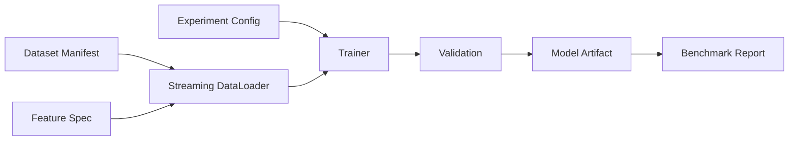

# Trainingspipeline

## Run-Manifest

Der versionierte Vertrag liegt in [`schemas/run-manifest.v1.schema.json`](../../schemas/run-manifest.v1.schema.json); das synthetische Beispiel liegt unter `examples/run-manifest.v1.json`.

- `run_id`, `run_kind`, `stage` und `status`;
- `git_commit` und Working-Tree-Status; Dirty-Worktrees zusätzlich mit `git_worktree_sha256` und einem `git_worktree_state`-Artefakt;
- generische `inputs` mit `kind`, `id`, optionalem `path` und `sha256`;
- Konfigurationspfad und Snapshot-Hash;
- Feature-/Ruleset-Versionen und Seeds;
- Python-, Dependency-Lock-, Hardware- und Toolversionen;
- Checkpoint-Auswahlregel, Metriken, Warnings und Artefakt-Hashes;
- lifecycleabhängige Zeitstempel für `created`, `running`, `succeeded`, `failed` und `cancelled`.

`STRICT`-Runs müssen `git_dirty=false` aufweisen. Andere Determinismusklassen dürfen Dirty-Worktrees nur mit dem vollständigen Zustandsdigest und dem reproduzierbaren Zustandsartefakt binden.

## Regeln

- Testsplit bleibt bis finalem Kandidatenvergleich unangetastet;
- Hyperparameter werden nur auf Train/Validation gewählt;
- Checkpoints sind nach valider Metrik benannt, nicht `best.pt` ohne Kontext;
- keine Notebook-only-Trainingslogik;
- Smoke-Dataset für CI, Full Dataset nur explizit;
- Abbrüche erzeugen `FAILED`-Manifest statt halbfertigem „success“.
