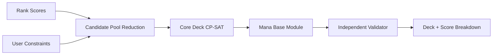

# Optimizer-Übersicht

Der Ranker beantwortet „Wie passend ist Karte X?“. Der Optimizer beantwortet „Welche Kombination erfüllt das gesamte Deckproblem?“.

## Phasen

1. legalen Pool filtern;
2. Kandidaten pro Rolle/Thema reduzieren, Must-Includes erhalten;
3. Nichtland-Core optimieren;
4. Mana Base ergänzen/optimieren;
5. Gesamtdeck unabhängig validieren;
6. Score-Komponenten und Relaxationen ausgeben.

Die Trennung verhindert einen unwartbaren Ein-Datei-Solver und erlaubt frühe MVPs mit fixer oder einfacher Mana Base.
